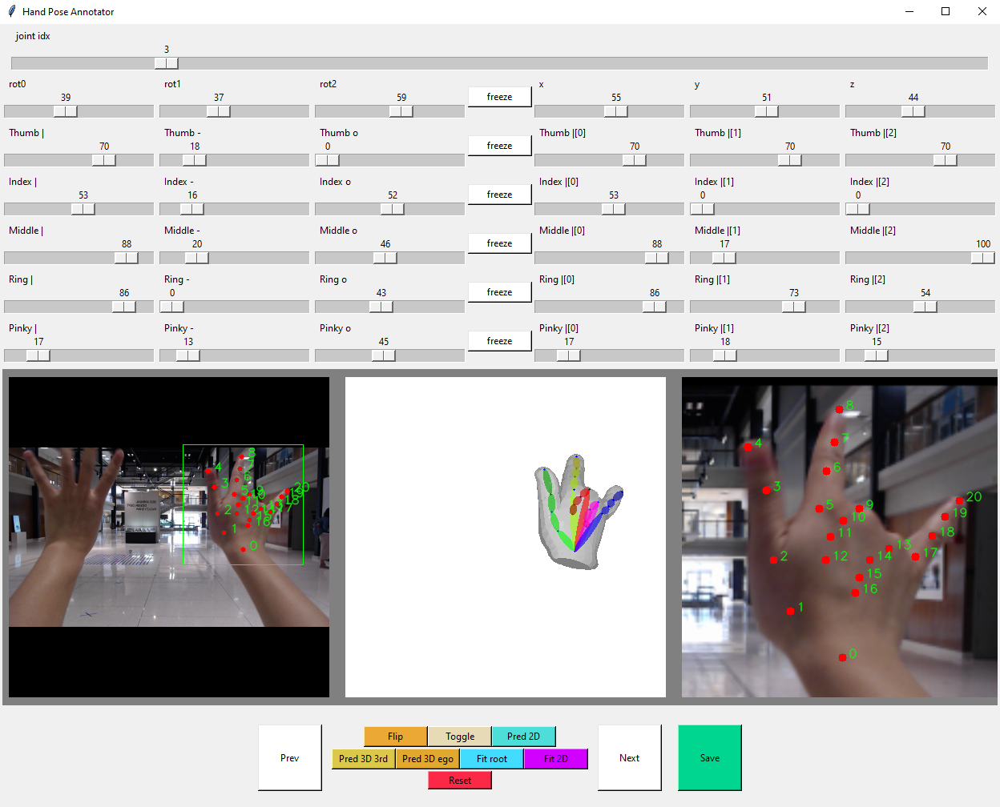
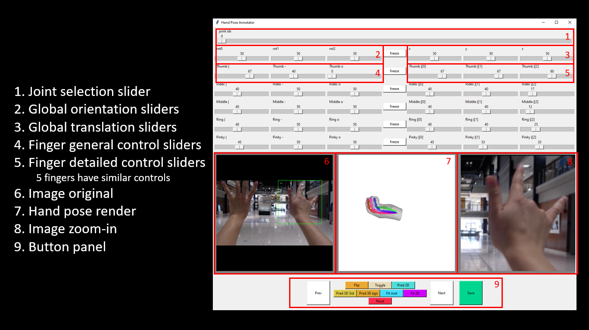

# 3D Hands for All

We introduce a 3D hand pose annotation tool that can annotate using a single RGB image. This tool enables you to provide an arbitrary number of 2D keypoints and automatically optimize the MANO hand pose to fit the provided keypoints. It also allows full control of all joint rotations (with physical constraints) for more refined annotation. In addition, we provide pretrained 2D and 3D models to enable automatic annotation. However, manual refinement might be needed for higher accuracy as the estimated 2D/3D keypoints can be imperfect.

Existing annotation methods rely on multi-view settings or depth cameras. Consequently, the collected color-based hand images are captured with laboratory environments as background. The limitation in quantity and diversity of 3D hand pose data in the community makes it challenging for learning-based models to generalize to scenes in the wild. This tool gives everyone the ability to obtain 3D hand pose data using monocular RGB images. If you need hand data in your specific domain to improve model performance, you might benefit from annotating data in your target domain. It is used in our paper [Ego2HandsPose: A Dataset for Egocentric Two-hand 3D Global Pose Estimation](https://arxiv.org/abs/2206.04927) for the annotation of the Ego2Hands dataset, which can be used to composite two-hand training images with significantly higher quantity and diversity. Click here for more details on [Ego2Hands](https://github.com/AlextheEngineer/Ego2Hands).

Download link for Ego2HandsPose:
[train](https://app.box.com/s/y5jx4g8cbqikcsgb2jx5g3ymqx71updj)
[test](https://app.box.com/s/wwze8ksixxinixkiq79eb84kulhdb8zm)

## Environment Setup
* We used the following steps to set up the proper environment in Anaconda on a Windows 10 machine:
  > conda create --name hand3d_env python=3.7\
  > conda activate hand3d_env\
  > conda install -c conda-forge opencv\
  > conda install pytorch torchvision torchaudio cudatoolkit=10.1 -c pytorch (see https://pytorch.org/ for a proper setting specific for your machine)\

* To install MANO hand, download the repository from https://github.com/hassony2/manopth and move the root folder into "models/MANO_layer". The "setup.py" file should be located at "models/MANO_layer/manopth/setup.py". To install, navigate to the same directory "setup.py" is located in and run
  > pip install .

* To install pytorch3d, please follow the official instructions [here](https://github.com/facebookresearch/pytorch3d/blob/main/INSTALL.md).

## Download Pretrained Models
* Download the following models and place them in the "models_saved" directory.

* Model 2D (https://drive.google.com/file/d/1hyba-Q_rCqHGrYVQgni7v_4Wbd-wsNpP/view?usp=share_link)

* Model 3D 3rd-person (https://drive.google.com/file/d/1Z9ThKF9bdrDhK2D3QRA_ZCBtdvA1TF4x/view?usp=share_link)

* Model 3D egocentric (https://drive.google.com/file/d/1twz0yQM6WCKm3Jk54oPVPVJDZF_g-3C6/view?usp=share_link)

## Usage

Run the following command to load the sample images from various datasets for annotation. You should see an UI similar to the image above.
  > python pose_annotator.py

The original image is padded to be square (shown in #6), which matches the image resolution of the rendered MANO hand image (shown in #7). The goal is to generate a MANO hand model that matches the hand in the image. Since the camera intrinsics are unknown, the resulting MANO hand's exact global 3D joint locations are based on the camera intrinsics of the rendering camera.

* Note that we only support the right hand. For annotating the left hand, simply click the "Flip" button. Hand side info will be recorded in file name when saving.

### 2D Keypoint Annotation
  * Manual Mode

Although the MANO parameters are controllable using the sliders that control the joint rotations (e.g. #2, #4, #5) and root joint location (#3), we want to minimize the need for manual annotation. To this end, the tool enables the user to annotate 2D keypoints by first using the joint selection slider (#1), then click either the original image (#6) or the magnified image (#8). To select the magnifying region, simply right click on the original image (#6) and scroll to adjust the cropping size. 

  * Auto Mode

To simplify the 2D keypoint annotation process, we pretrained a HRNet on Ego2HandsPose, HIU-DMTL and FreiHand. To automatically predict the 2D keypoints, simply provide the hand detection bounding box and click "Pred 2D". Manual refinement of certain keypoints might be needed.

### 3D Hand Fitting
  * Manual Mode

Given an arbitrary number of annotated 2D keypoints, follow these steps:

1. button "Fit root" fits the hand using only the wrist joint (joint#0 needs to be annotated)

2. To fit the MANO hand from the default pose, you would first need to adjust the global orientation sliders (shown in #2) to give the hand a good initial point. 

3. With a good initial pose, you can then click "Fit 2D" to gradient descent into the global minimum given the annotated 2D keypoints. Due to the lack of depth info, sometimes there are two plausible solution for the same set of 2D keypoints. In this case, you can either manually rotate the finger(s) to be closer to the real solution and then press "Fit 2D". 

4. Use "Toggle" button to see if the rendered hand overlays with the hand in the image well. When automatic fitting does not yield a perfect solution, the user can always manually adjust the joint rotations for some small final adjustments. 

5. Final slight adjustments using manual refinement. For detailed control of each finger, the 3 sliders on the left control the 3D rotation of the first joint of the specific finger (shown in #4). The 3 sliders on the right control the 1D rotation of the first, second and third joint of the specific finger. 

  * Auto Mode

To simplify the overall fitting process, we pretrained a custom Resnet on MANO3DHands (see paper) for 3D canonical pose estimation. After a hand detection box is provided, you can simply click "Pred 3D 3rd" or "Pred 3D ego" (trained on MANO3DHands's 3rd person and egocentric version respectively) to automatically predict the 2D keypoints, 3D canonical keypoints, and fit the hand. "Pred 3D 3rd" works well in general for all viewpoints. "Pred 3D ego" should work better for egocentric viewpoint. Manual refinement might be needed depending on the 2D/3D estimation accuracy. 

### Final Validation
It can be hard to thoroughly examine the 3D pose from a single view. To validate the hand pose from other views, click the "freeze" button next to the global orientation sliders (#2). You can now change the global orientation freely to view the hand pose from different angles. After validation, click the "restore" button to restore the previously saved global orientation.

### Saving
To save the hand pose, click the "Save" button, which will save the MANO parameters, 3D global joint locations and 2D image joint locations in the same directory for the input images.

  * MANO file

This ndarray contains 51 values. The first 3 values contain the global 3D root joint location (x: increases going right. y: increases going down. z: increases going away from camera origin). The next 3 values contain the global orientation for the hand pose (rotational values for the root joint). The remaining 45 values contain rotations for 15 hand joints (finger tip does not have a rotation).

  * 3D Global Keypoints file

This ndarray has shape of [21, 3], which contains the 3D global joint location (in cm) for all 21 joints.

  * 2D Global Keypoints file

This ndarray has shape of [21, 2], which contains the 2D joint location ((row, col) in percentages, so they are invariant to image scaling) for all 21 joints. 

## License
This tool can be used freely for scientific or commercial purposes. If you use this tool for data annotation of your research, please cite the corresponding [paper](https://arxiv.org/abs/2206.04927).
